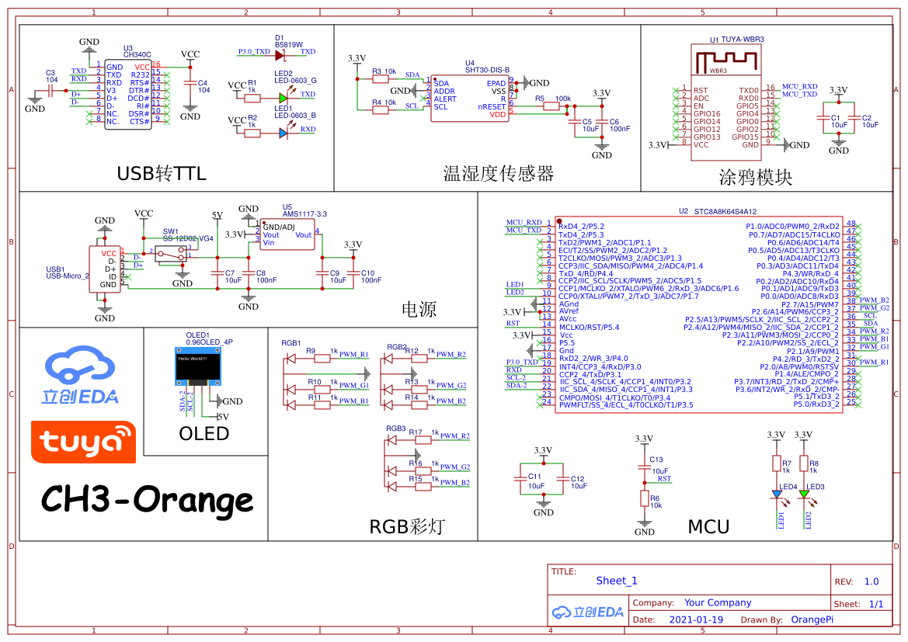
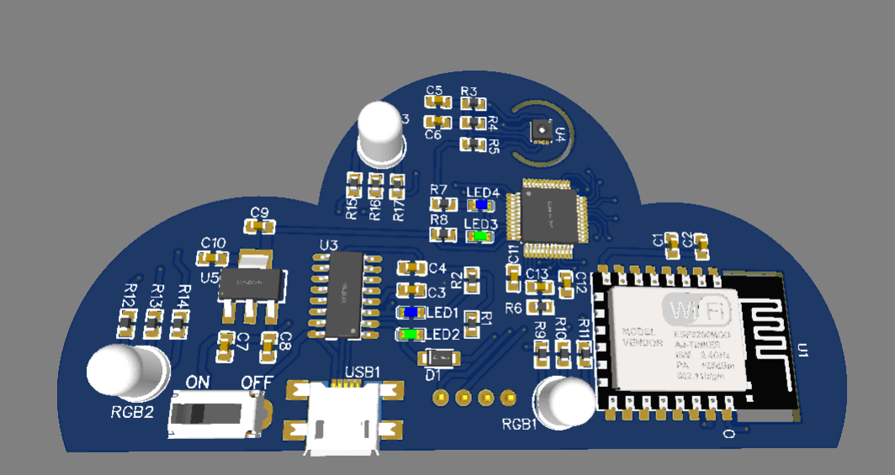
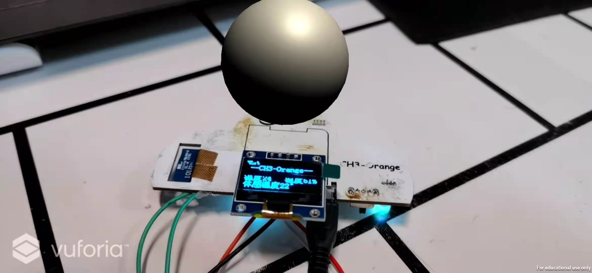
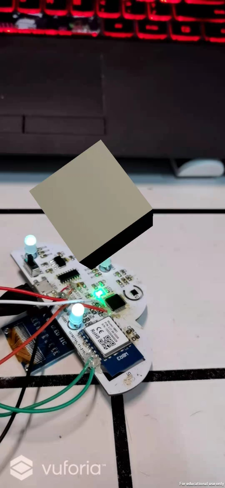

# 基于涂鸦IOT平台的一个温湿度传感器

**This project is developed using Tuya SDK, which enables you to quickly develop branded apps connecting and controlling smart scenarios of many devices.
For more information, please check Tuya Developer Website.**

## 功能设计
 - [x] OLED显示
 - [x] 温湿度监测
 - [x] 温湿度信息上传
 - [ ] 获取本地天气
 - [ ] 根据天气更改REB灯的显示状态
 - [ ] 利用Vuforia引擎实现与传感器的AR交互

## 硬件设计

采用STC8A8K64S4A12作为MCU主控，温湿度传感器SHT30和显示屏OLED通过IIC与MCU进行通信，涂鸦模块WBR3通过串口与MCU进行交互。

**目前发现的问题是，MCU与涂鸦模块无法通过硬件串口4通信，猜测是没有外界上拉电阻，所以只能通过跳线外接串口1进行通信**

## 软件设计

在Unity内利用Vuforia引擎进行物体识别，将温湿度信息以AR的形式显示出来。（不过还没有完成）

目前的实现效果（只实现了利用Vuforia识别并显示一个物体，还没有移植涂鸦的SDK）

